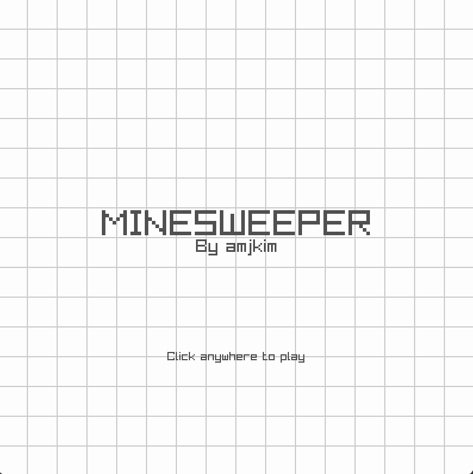
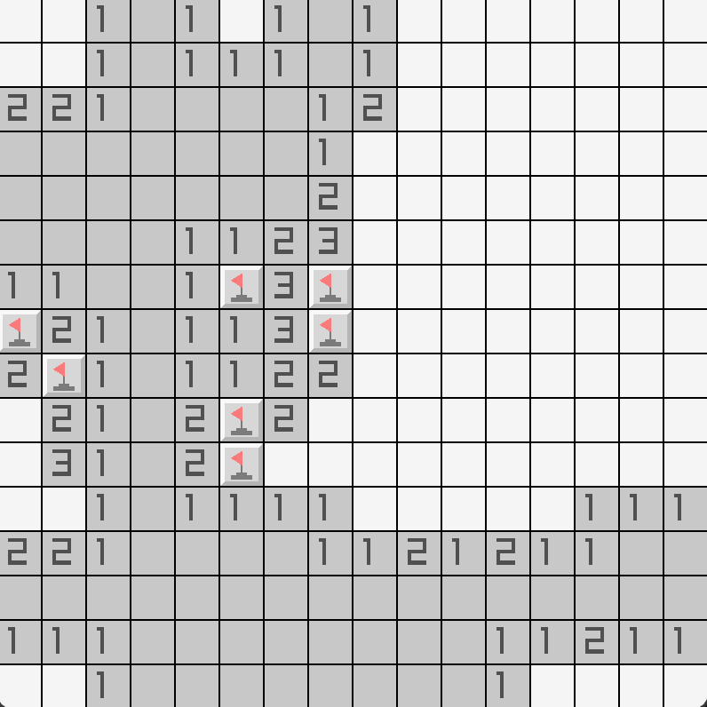
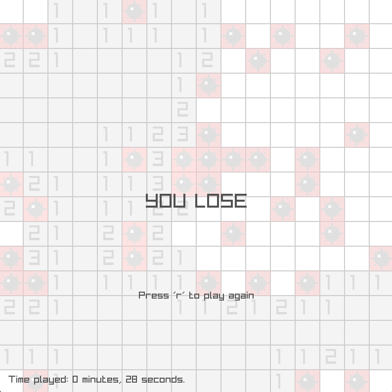

# raylib-minesweeper
Basic minesweeper game made with raylib and C++

## Features
- First click is always protected from mines
- Automatically clears tiles with no neighboring mines using recursion
- Game timer

## Images

  
  
  

